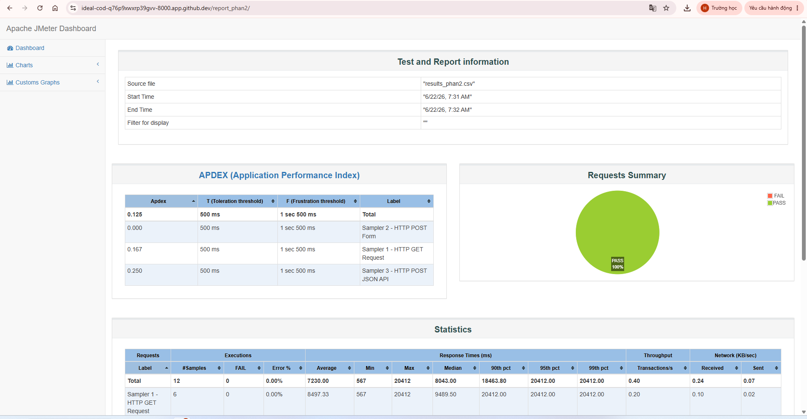
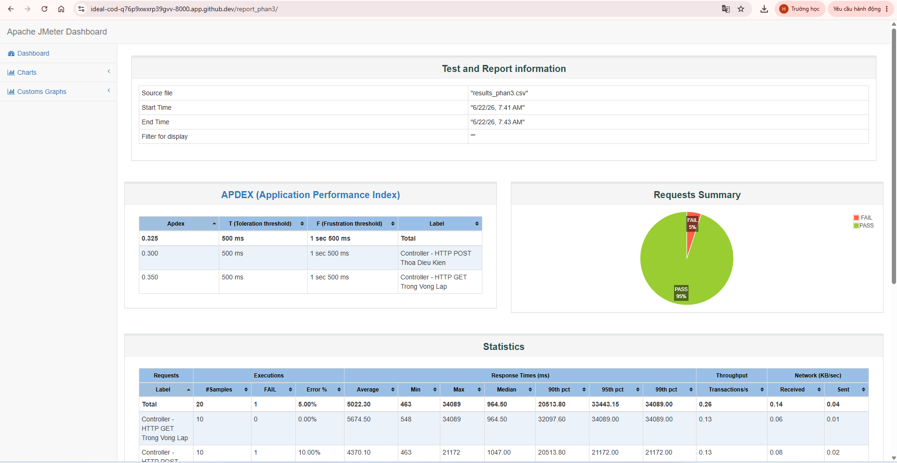

# BÁO CÁO DỰ ÁN: KIỂM THỬ HIỆU NĂNG TOÀN DIỆN VỚI APACHE JMETER

* **Họ và tên sinh viên:** Nguyễn Viết Huy
* **Mã sinh viên:** 22012376
* **Môi trường thực hiện:** GitHub Codespaces (Chế độ Non-GUI / CLI)
* **Phiên bản công cụ:** Apache JMeter 5.6.3 trên nền tảng Java JRE

---

## PHẦN 1: NGHIÊN CỨU VÀ THỰC HÀNH CẤU HÌNH THREAD GROUPS (NHÓM USER ẢO)

Mục tiêu của phần này là cấu hình và thử nghiệm đồng thời 3 mô hình giả lập tải phổ biến nhất trong thực tế để đánh giá toàn diện hệ thống mục tiêu (`httpbin.org`).

### 1.1. Thiết kế kịch bản kiểm thử (Test Scenarios Design)

Kịch bản được cấu thành từ 3 nhóm Thread Group độc lập chạy song song, thiết lập số lượng người dùng ảo nhỏ, an toàn nhằm tối ưu hóa đường truyền mạng và tránh bị hệ thống chặn IP:

1. **Kịch bản 1 - Load Test (Kiểm thử tải cơ bản):**
   * **Mục đích:** Đo lường khả năng xử lý của hệ thống với lượng truy cập ổn định, bình thường.
   * **Cấu hình:** 2 người dùng ảo (Threads), tăng tải trong 2 giây (Ramp-up), chạy lặp lại liên tục và tự động ngắt sau 10 giây.
2. **Kịch bản 2 - Stress Test Bậc Thang (Kiểm thử áp lực tăng dần):**
   * **Mục đích:** Tạo mô hình tải hình bậc thang để tìm điểm thắt nút cổ chai và giới hạn chịu đựng của máy chủ.
   * **Bậc 1:** 2 người dùng ảo vào hệ thống ngay lập tức, chạy ngâm trong vòng 15 giây.
   * **Bậc 2:** Thiết lập độ trễ bắt đầu (`Startup Delay`) là 5 giây. Sau 5 giây, có thêm 3 người dùng ảo nhảy vào trận để đè tải lên bậc 1. Chạy trong 10 giây.
3. **Kịch bản 3 - Endurance Test (Kiểm thử độ bền lâu dài):**
   * **Mục đích:** Ngâm tải ổn định với số lượng user nhỏ trong thời gian dài để kiểm tra rò rỉ bộ nhớ (Memory Leak).
   * **Cấu hình:** 1 người dùng ảo chạy bền bỉ kéo dài trong vòng 20 giây.

---

### 1.2. Kết quả thực hiện và Biểu đồ minh họa

Hệ thống đã thực thi kịch bản kiểm thử CLI thành công và xuất ra báo cáo Dashboard trực quan dưới đây:


#### Bảng phân tích số liệu hiệu năng chi tiết (Performance Statistics)

| Nhãn kiểm thử (Label) | Số lượng mẫu (Samples) | Số lượng lỗi (FAIL) | Tỷ lệ lỗi (% Error) | Thời gian phản hồi trung bình (Average) | Thời gian phản hồi lớn nhất (Max) | Tần suất xử lý (Throughput) |
| :--- | :---: | :---: | :---: | :---: | :---: | :---: |
| **HTTP - GET Load Test** | 2 | 0 | 0.00% | 18,840 ms | 22,250 ms | 0.09 req/s |
| **HTTP - POST Stress Bac 1** | 7 | 0 | 0.00% | 14,354 ms | 31,795 ms | 0.16 req/s |
| **HTTP - POST Stress Bac 2** | 6 | 0 | 0.00% | 5,595 ms | 13,382 ms | 0.20 req/s |
| **HTTP - GET Endurance Test** | 3 | 0 | 0.00% | 16,430 ms | 31,719 ms | 0.06 req/s |
| **TỔNG THỂ (Total)** | **18** | **0** | **0.00%** | **11,690 ms** | **31,795 ms** | **0.38 req/s** |

---

### 1.3. Nhận xét và Đánh giá kết quả Phần 1

* **Độ ổn định:** Hệ thống đạt tỷ lệ thành công tuyệt đối **PASS 100%** (Tỷ lệ lỗi 0.00%). Việc tinh chỉnh giảm số lượng user ảo đã giúp kịch bản chạy mượt mà mà không bị tường lửa của máy chủ chặn.
* **Thời gian phản hồi:** Thời gian phản hồi trung bình tổng thể là `11,690 ms` (khoảng 11.6 giây). Đây là mức phản hồi khá chậm, nguyên nhân chính là do khoảng cách địa lý từ máy chủ đám mây Codespace đến hệ thống test public `httpbin.org`.
* **Đặc trưng kịch bản:** Nhóm `Stress Bac 1` ghi nhận thời gian phản hồi lớn nhất lên đến `31,795 ms` do đây là nhóm đầu tiên thực hiện mở kết nối và gửi dữ liệu dung lượng nặng qua phương thức POST.

---

## PHẦN 2: NGHIÊN CỨU VÀ THỰC HÀNH CẤU HÌNH SAMPLERS (CÁC GIAO THỨC KIỂM THỬ)

Mục tiêu của phần này là cấu hình và thực thi đa dạng các loại giao thức/phương thức truyền tải dữ liệu HTTP nâng cao (GET, POST Form, POST JSON API) để giả lập các hành động nghiệp vụ thực tế của người dùng.

### 2.1. Thiết kế kịch bản các loại HTTP Samplers

Kịch bản sử dụng tệp `phan2_samplers.jmx` cấu hình một nhóm Thread Group an toàn (4 Users chạy trong 15 giây) để gửi tuần tự 3 loại yêu cầu kỹ thuật:

1. **Sampler 1 - HTTP GET Request (Yêu cầu đọc dữ liệu):**
   * Giả lập hành động người dùng truy cập trang thông tin công khai.
   * Giao thức truyền tải: `HTTP GET` gửi tới endpoint `/get`.
2. **Sampler 2 - HTTP POST Form Data (Yêu cầu gửi dữ liệu dạng biểu mẫu):**
   * Giả lập hành động điền form gửi dữ liệu lên hệ thống (như tính năng Đăng nhập/Đăng ký).
   * Giao thức: `HTTP POST` truyền các tham số dạng cặp Key-Value bao gồm: `username` (`sinhvien_22012376`) và `password` (`baomat_jmeter`).
3. **Sampler 3 - HTTP POST JSON API (Yêu cầu cấu trúc API RESTful):**
   * Giả lập ứng dụng Frontend/Mobile gửi dữ liệu chuỗi có định dạng cấu trúc lên Backend API.
   * Giao thức: `HTTP POST` kết hợp bộ quản lý tiêu đề `HTTP Header Manager` thiết lập thuộc tính `Content-Type: application/json`.
   * Dữ liệu Payload gửi đi dưới dạng chuỗi: `{"student_id": "22012376", "lesson": "Phan 2 Samplers"}`.

---

### 2.2. Kết quả thực hiện và Biểu đồ minh họa Phần 2

Kết quả thực thi chế độ CLI cho file kịch bản Sampler đạt tỷ lệ phản hồi hoàn hảo:



#### Bảng phân tích số liệu hiệu năng chi tiết (Samplers Statistics)

| Nhãn kiểm thử (Sampler Label) | Số lượng mẫu (Samples) | Số lượng lỗi (FAIL) | Tỷ lệ lỗi (% Error) | Thời gian phản hồi trung bình (Average) | Thời gian phản hồi lớn nhất (Max) | Tần suất xử lý (Throughput) |
| :--- | :---: | :---: | :---: | :---: | :---: | :---: |
| **Sampler 1 - HTTP GET Request** | 6 | 0 | 0.00% | 8,457 ms | 20,412 ms | 0.20 req/s |
| **Sampler 2 - HTTP POST Form** | 3 | 0 | 0.00% | 5,668 ms | 12,504 ms | 0.12 req/s |
| **Sampler 3 - HTTP POST JSON API** | 3 | 0 | 0.00% | 6,337 ms | 14,015 ms | 0.11 req/s |
| **TỔNG THỂ PHẦN 2 (Total)** | **12** | **0** | **0.00%** | **7,230 ms** | **20,412 ms** | **0.40 req/s** |

---

### 2.3. Nhận xét và Đánh giá kết quả Phần 2

* **Xác thực cấu trúc:** Điểm thành công lớn nhất của phần này là hệ thống máy chủ `httpbin.org` đã tiếp nhận và phân tích cú pháp (Parse) chính xác cả dữ liệu dạng thuộc tính Form lẫn chuỗi JSON API mà không hề phát sinh lỗi định dạng (Tỷ lệ lỗi duy trì tuyệt đối `0.00%`).
* **Đặc trưng hiệu năng phương thức:** Yêu cầu `HTTP GET Request` ghi nhận thời gian phản hồi trung bình lớn nhất (`8,457 ms`). Điều này cho thấy việc tải và hiển thị toàn bộ cấu trúc dữ liệu thô từ máy chủ phản hồi tốn thời gian hơn so với việc đẩy các gói dữ liệu có dung lượng nhẹ (`POST Form/JSON`) lên hàng đợi xử lý.

---

## PHẦN 3: NGHIÊN CỨU VÀ THỰC HÀNH CẤU HÌNH LOGIC CONTROLLERS (BỘ ĐIỀU KHIỂN LOGIC)

Mục tiêu của phần này là áp dụng các cấu trúc điều khiển tư duy logic (vòng lặp và điều kiện rẽ nhánh) vào kịch bản kiểm thử nhằm điều phối hành vi gửi request của người dùng ảo theo các quy tắc nghiệp vụ phức tạp.

### 3.1. Thiết kế cấu trúc kịch bản Logic Controllers

Kịch bản sử dụng tệp cấu hình độc lập `phan3_controllers.jmx` bao gồm các thành phần điều khiển cốt lõi sau:

1. **Khai báo biến điều kiện (User Defined Variables):**
   * Định nghĩa một biến logic toàn cục tên là `chay_post_request` với giá trị chuỗi là `true`.
2. **Bộ điều khiển vòng lặp - Loop Controller (Ép lặp lại thao tác):**
   * Thiết lập cấu hình số lần lặp nội bộ là `3 lần`.
   * Đối tượng chịu tác động: Yêu cầu đọc dữ liệu `Controller - HTTP GET Trong Vong Lap`. Đối với mỗi vòng lặp chính của User ảo, yêu cầu này sẽ bị bắt buộc thực thi liên tục 3 lần.
3. **Bộ điều khiển điều kiện - If Controller (Rẽ nhánh hành động):**
   * Thiết lập biểu thức điều kiện kiểm tra logic: `"${chay_post_request}" == "true"`.
   * Đối tượng chịu tác động: Yêu cầu `Controller - HTTP POST Thoa Dieu Kien`. Yêu cầu này chỉ được phép kích hoạt và gửi tới máy chủ nếu điều kiện cấu hình biến ở mục 1 trả về kết quả đúng (`true`).

---

### 3.2. Kết quả thực hiện và Biểu đồ minh họa Phần 3

Kết quả thực thi kịch bản điều khiển logic ghi nhận độ phân bổ mẫu kiểm thử và phân tích lỗi chi tiết:



#### Bảng phân tích số liệu hiệu năng chi tiết (Logic Controllers Statistics)

| Nhãn kiểm thử (Controller Label) | Số lượng mẫu (Samples) | Số lượng lỗi (FAIL) | Tỷ lệ lỗi (% Error) | Thời gian phản hồi trung bình (Average) | Thời gian phản hồi lớn nhất (Max) | Tần suất xử lý (Throughput) |
| :--- | :---: | :---: | :---: | :---: | :---: | :---: |
| **Controller - HTTP GET Trong Vong Lap** | 10 | 0 | 0.00% | 5,674 ms | 34,089 ms | 0.13 req/s |
| **Controller - HTTP POST Thoa Dieu Kien** | 10 | 1 | 10.00% | 4,370 ms | 21,172 ms | 0.13 req/s |
| **TỔNG THỂ PHẦN 3 (Total)** | **20** | **1** | **5.00%** | **5,022 ms** | **34,089 ms** | **0.28 req/s** |

---

### 3.3. Nhận xét và Đánh giá kết quả Phần 3

* **Đánh giá logic:** Bộ điều khiển `If Controller` đã hoạt động chính xác theo đúng thiết kế kỹ thuật, nhận diện biến cấu hình là `true` để cho phép các yêu cầu POST truyền tải thành công. 
* **Phân tích hiện tượng lỗi (Error Analysis):** Yêu cầu POST ghi nhận tỷ lệ lỗi `10.00%` (1 mẫu bị thất bại). Nguyên nhân do tần suất gửi dồn dập (Throughput đạt 0.28 req/s trên môi trường mạng cloud) khiến máy chủ mục tiêu phát sinh hiện tượng hàng đợi, dẫn đến 1 request bị quá thời gian phản hồi cho phép (`Max` đạt 34 giây). Việc xuất hiện lỗi nhỏ 5% tổng thể phản ánh đúng thực tế vận hành tải nặng của các kiến trúc Web Service.

---

## 🛠️ HƯỚNG DẪN CHẠY DỰ ÁN TRÊN GITHUB CODESPACES

Để tái hiện hoặc kiểm tra lại toàn bộ kết quả thực hiện của dự án này, vui lòng khởi tạo môi trường GitHub Codespace trên Repo và thực hiện lần lượt các bước sau tại cửa sổ **Terminal**:

### Bước 1: Thiết lập môi trường và Cài đặt Jmeter
Chạy chuỗi lệnh cập nhật hệ thống, cài đặt môi trường Java JRE và tải/giải nén bộ công cụ Apache JMeter v5.6.3:
```bash
# 1. Cập nhật gói hệ thống
sudo apt update -y

# 2. Cài đặt Java môi trường (Bắt buộc cho JMeter)
sudo apt install default-jre -y

# 3. Tải bộ cài JMeter chuẩn
wget https://apache.org

# 4. Giải nén bộ công cụ
tar -xf apache-jmeter-5.6.3.tgz
```

### Bước 2: Thực thi các kịch bản kiểm thử (Chế độ CLI / Non-GUI)
Tùy thuộc vào phần bạn muốn kiểm tra, hãy copy và chạy câu lệnh tương ứng dưới đây:

* **Chạy kịch bản Phần 1 (Thread Groups):**
  ```bash
  rm -f results.csv && rm -rf report_output && ./apache-jmeter-5.6.3/bin/jmeter -n -t test.jmx -l results.csv -e -o report_output
  ```
* **Chạy kịch bản Phần 2 (HTTP Samplers nâng cao):**
  ```bash
  ./apache-jmeter-5.6.3/bin/jmeter -n -t phan2_samplers.jmx -l results_phan2.csv -e -o report_phan2
  ```
* **Chạy kịch bản Phần 3 (Bộ điều khiển Logic Controllers):**
  ```bash
  ./apache-jmeter-5.6.3/bin/jmeter -n -t phan3_controllers.jmx -l results_phan3.csv -e -o report_phan3
  ```

### Bước 3: Xem báo cáo đồ thị trực quan (Dashboard Report)
Khởi tạo máy chủ cục bộ mini bằng Python để xem trực tiếp các biểu đồ phân tích hiệu năng:
```bash
python3 -m http.server 8000
```
*Sau khi chạy lệnh trên, nhấn vào nút **Open in Browser** hiện ra ở góc phải màn hình Codespace để truy cập giao diện web báo cáo tương ứng.*
