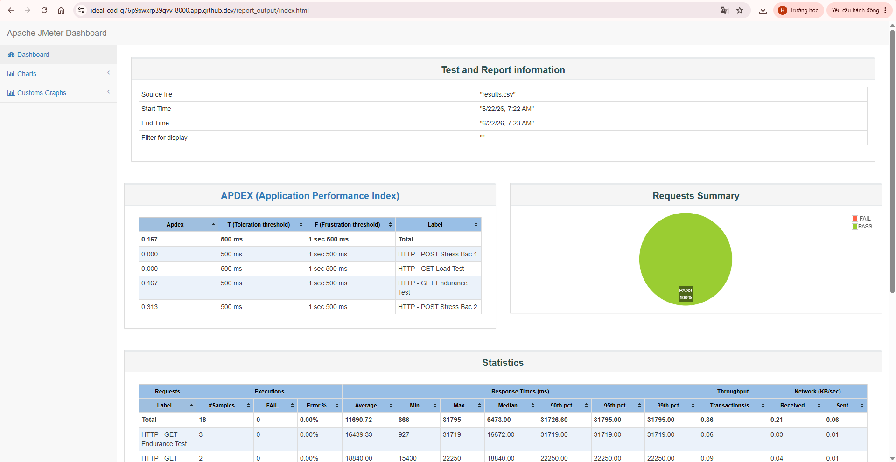

# BÁO CÁO DỰ ÁN: KIỂM THỬ HIỆU NĂNG TOÀN DIỆN VỚI APACHE JMETER

* **Họ và tên sinh viên:** Nguyễn Viết Huy
* **Mã sinh viên:** 22012376
* **Môi trường thực hiện:** GitHub Codespaces (Chế độ Non-GUI / CLI)
* **Phiên bản công cụ:** Apache JMeter 5.6.3 trên nền tảng Java JRE

---

## PHẦN 1: NGHIÊN CỨU VÀ THỰC HÀNH CẤU HÌNH THREAD GROUPS (NHÓM USER ẢO)

Mục tiêu của phần này là cấu hình và thử nghiệm đồng thời 3 mô hình giả lập tải phổ biến nhất trong thực tế để đánh giá toàn diện hệ thống mục tiêu (`httpbin.org`).

### 1.1. Thiết kế kịch bản kiểm thử (Test Scenarios Design)

Kịch bản được cấu thành từ 3 nhóm Thread Group độc lập chạy song song, thiết lập số lượng người dùng ảo nhỏ, an toàn nhằm tối ưu hóa đường truyền mạng và tránh bị hệ thống chặn IP:

1. **Kịch bản 1 - Load Test (Kiểm thử tải cơ bản):**
   * **Mục đích:** Đo lường khả năng xử lý của hệ thống với lượng truy cập ổn định, bình thường.
   * **Cấu hình:** 2 người dùng ảo (Threads), tăng tải trong 2 giây (Ramp-up), chạy lặp lại liên tục và tự động ngắt sau 10 giây.
2. **Kịch bản 2 - Stress Test Bậc Thang (Kiểm thử áp lực tăng dần):**
   * **Mục đích:** Tạo mô hình tải hình bậc thang để tìm điểm thắt nút cổ chai và giới hạn chịu đựng của máy chủ.
   * **Bậc 1:** 2 người dùng ảo vào hệ thống ngay lập tức, chạy ngâm trong vòng 15 giây.
   * **Bậc 2:** Thiết lập độ trễ bắt đầu (`Startup Delay`) là 5 giây. Sau 5 giây, có thêm 3 người dùng ảo nhảy vào trận để đè tải lên bậc 1. Chạy trong 10 giây.
3. **Kịch bản 3 - Endurance Test (Kiểm thử độ bền lâu dài):**
   * **Mục đích:** Ngâm tải ổn định với số lượng user nhỏ trong thời gian dài để kiểm tra rò rỉ bộ nhớ (Memory Leak).
   * **Cấu hình:** 1 người dùng ảo chạy bền bỉ kéo dài trong vòng 20 giây.

---

### 1.2. Kết quả thực hiện và Biểu đồ minh họa

Hệ thống đã thực thi kịch bản kiểm thử CLI thành công và xuất ra báo cáo Dashboard trực quan dưới đây:

#### Bảng phân tích số liệu hiệu năng chi tiết (Performance Statistics)

| Nhãn kiểm thử (Label) | Số lượng mẫu (Samples) | Số lượng lỗi (FAIL) | Tỷ lệ lỗi (% Error) | Thời gian phản hồi trung bình (Average) | Thời gian phản hồi lớn nhất (Max) | Tần suất xử lý (Throughput) |
| :--- | :---: | :---: | :---: | :---: | :---: | :---: |
| **HTTP - GET Load Test** | 2 | 0 | 0.00% | 18,840 ms | 22,250 ms | 0.09 req/s |
| **HTTP - POST Stress Bac 1** | 7 | 0 | 0.00% | 14,354 ms | 31,795 ms | 0.16 req/s |
| **HTTP - POST Stress Bac 2** | 6 | 0 | 0.00% | 5,595 ms | 13,382 ms | 0.20 req/s |
| **HTTP - GET Endurance Test** | 3 | 0 | 0.00% | 16,430 ms | 31,719 ms | 0.06 req/s |
| **TỔNG THỂ (Total)** | **18** | **0** | **0.00%** | **11,690 ms** | **31,795 ms** | **0.38 req/s** |

---

### 1.3. Nhận xét và Đánh giá kết quả Phần 1

* **Độ ổn định:** Hệ thống đạt tỷ lệ thành công tuyệt đối **PASS 100%** (Tỷ lệ lỗi 0.00%). Việc tinh chỉnh giảm số lượng user ảo đã giúp kịch bản chạy mượt mà mà không bị tường lửa của máy chủ chặn.
* **Thời gian phản hồi:** Thời gian phản hồi trung bình tổng thể là `11,690 ms` (khoảng 11.6 giây). Đây là mức phản hồi khá chậm, nguyên nhân chính là do khoảng cách địa lý từ máy chủ đám mây Codespace đến hệ thống test public `httpbin.org`.
* **Đặc trưng kịch bản:** Nhóm `Stress Bac 1` ghi nhận thời gian phản hồi lớn nhất lên đến `31,795 ms` do đây là nhóm đầu tiên thực hiện mở kết nối và gửi dữ liệu dung lượng nặng qua phương thức POST.
